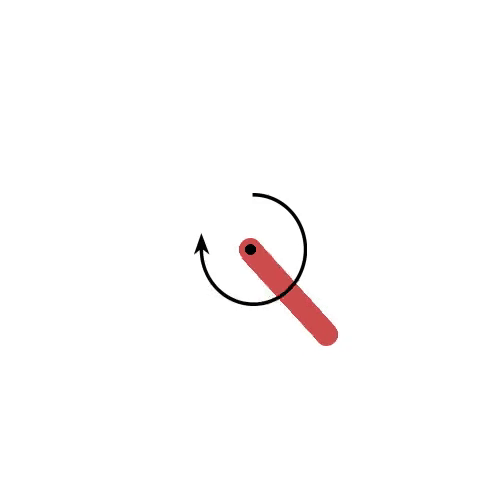

This repository contains the implementation of the Deep Deterministic Policy Gradient (DDPG) method using PyTorch. 
Additionally, I have prepared a comprehensive beginner tutorial regarding the DDPG algorithm, which can be accessed 
as follows:
[📘 View the DDPG Tutorial PDF](./DDPG_Tutorial.pdf)

The DDPG algorithm is applied to the Pendulum-v1 environment from OpenAI Gym.

The DDPG method is a powerful off-policy Actor-Critic algorithm in Deep Reinforcement Learning, specifically designed
for environments with continuous action spaces. This property makes DDPG highly effective for real-world applications, 
such as robotics control, where continuous actions and precise manipulation are essential.

I would be grateful for any feedback on this code. Please feel free to reach out to me at: alireza8khaleghi@gmail.com.

Thank you for taking the time to review this work.

